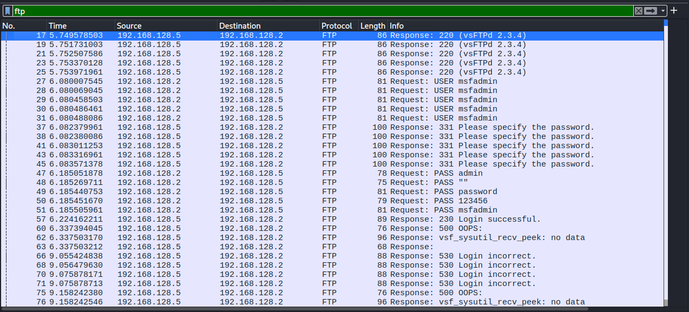

# FTP Brute Force Attack Analysis 

## Descripcion 

se realizo un ataque de fuerza bruta contra el servicio FTP del host objetivo utilizando Hydram con el objetivo de identificar
credenciales validas mediante multiples intentos de autenticacion.

--

## Entorno del laboratorio 

- Atacante: 192.168.128.2
- Victima: 192.168.128.5
- Servicio: FTP 
- Herramienta: Hydra

## Evidencia

### Intentos de autenticacion

# Analisis

Se observan multiples intentos de autenticacion FTP desde el host atacante hacia el servidor utilizando el usuario msfadmin con diferentes contrasenias.
Este comportamiento indica un proceso automatizado de prueba de credenciales, donde las respuestas del servidor evidencian multiples intentos fallidos 
de autennticacion. Este patron es consistente con un ataque de fuerza brtua dirigido a identificar credenciales validas en un servicio de FTP.
