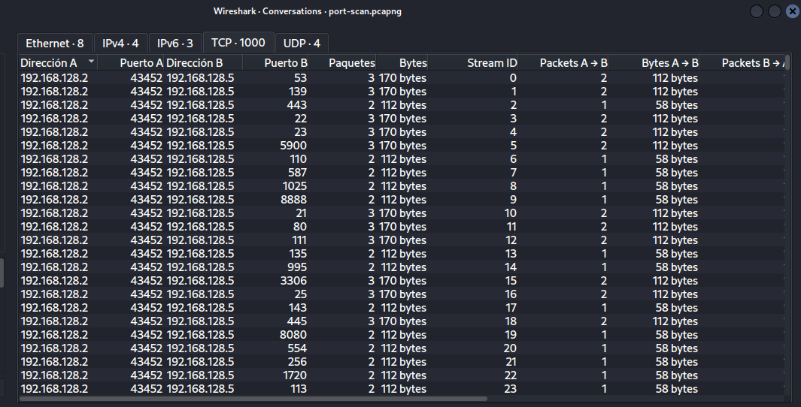
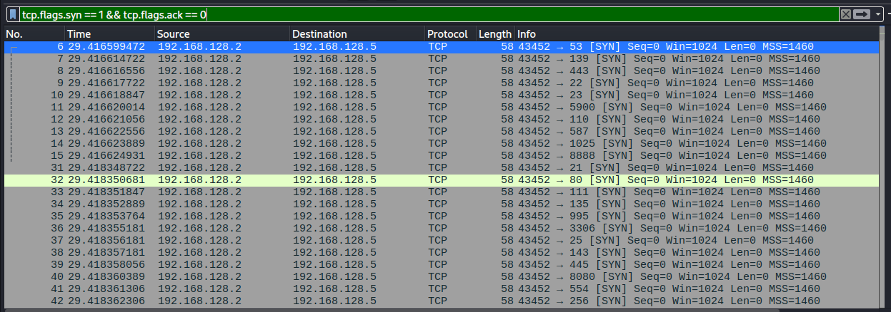

# Port Scan Analysis 

## Descripcion 

Se realizo un escaneo de puertos contra el host objetivo con el fin de identificar servicios activos y puertos abiertos mediante el envio de paquetes 
TCP.

--

## Entorno del Laboratorio

- Atacante: 192.168.128.2
- Victima: 192.168.128.5
- Tecnica: TCP SYN Scan 

## Evidencia 

 
### Vista general del trafico

### Paquetes SYN detectados

--

## Analisis 

Se observan multiples paquetes TCP con bandera SYN enviados desde el host atacante hacia difetenres puertos del host objetivo en un corto periodo 
de tiempo. Este comportamiento indica intentos de iniciar multiples conexiones TCP sin completarlas. Las respuestas del servidor incluyen paquetes
SYN-ACK para puertos abiertos y RST para puertos cerrados, lo que permite identificar el estado de los puertos escaneados. Este patron es caracteristico
de un escaneo de puertos tipo SYN (half-open scan), utilizado para el reconocimiento de servicios activos en un sistema. 
