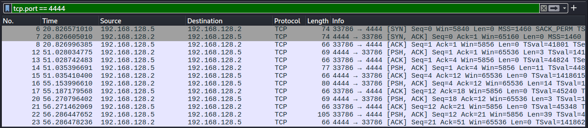

# Reverse Shell Analysis 

## Descripcion
Se establecio una reverse shell desde el host victima hacia el atacante con el fin de obtener acceso remoto al sistema mediante una conexion 
TCP persistente.

--

## Entorno del Laboratorio

- Atancate: 192.168.128.2
- Victima: 192.168.128.5
- Puerto: 4444
- Herramienta: Netcat

--

# Evidencia 

Trafico de la reverse Shell

--

# Analisis

Se observa una conexion TCP iniciada desde el host victima hacia el atacante en el puerto 4444. El establecimineto de la conexion se identifica mediante
el handshake TCP (SYN, SYN-ACK, ACK). Posteriormente, se detecta el trafico constante en ambas direcciones con paquetes PSH, ACK, lo que indica un flujo
continuo entre ambos hosts. Este comportamiento es caracteristico de una sesion interactiva remota, consistente de una reverse shell.
